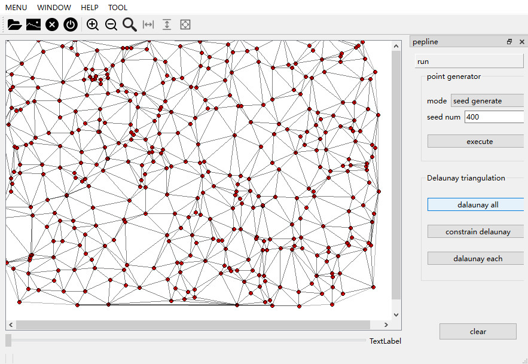
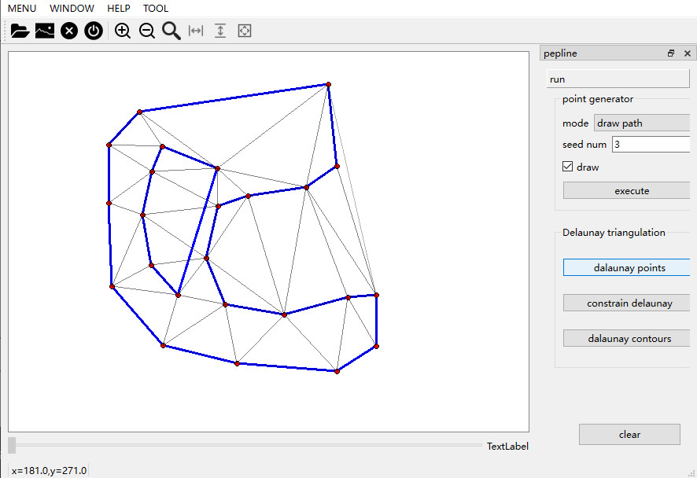
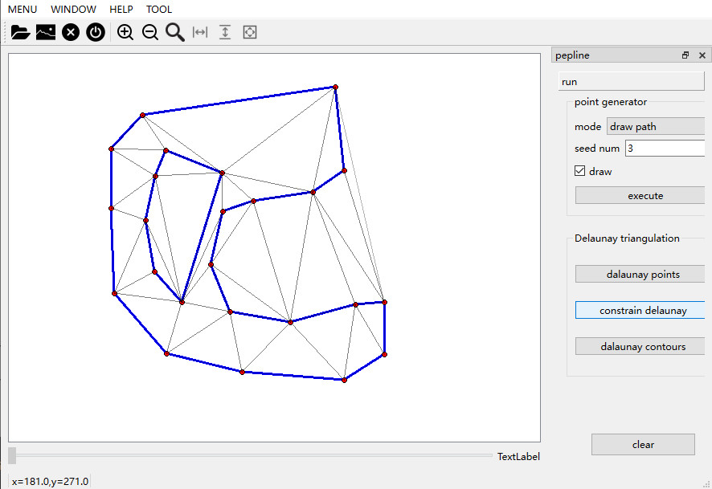
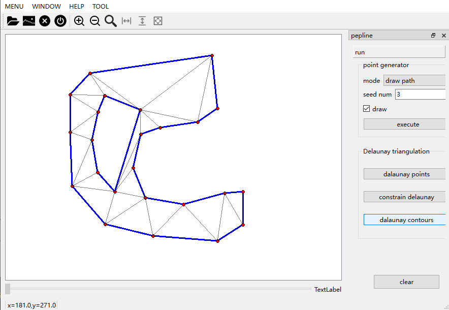

# DelaunayTriangulationDemo
DelaunayTriangulation demo for points，constrain edge，hierarchy contour
> DT for random seed points

> DT for draw path

> CDT for draw path

> CDT for draw path,remove outlier triangle 

